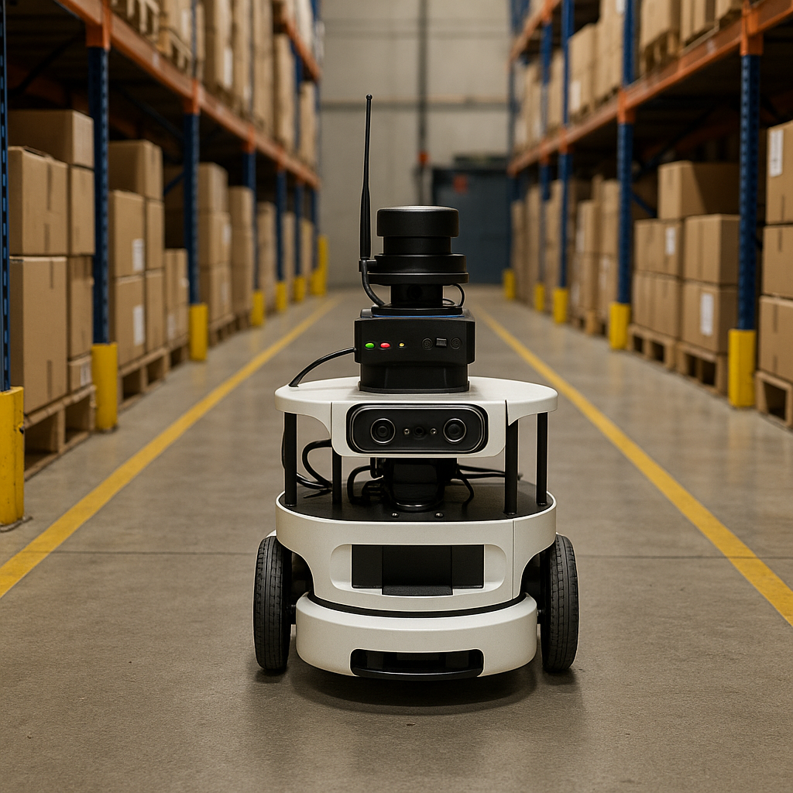
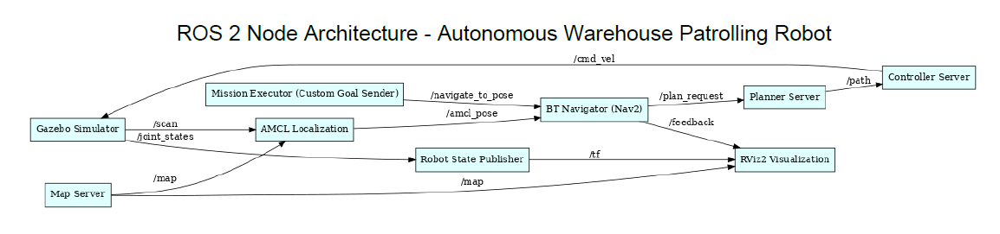
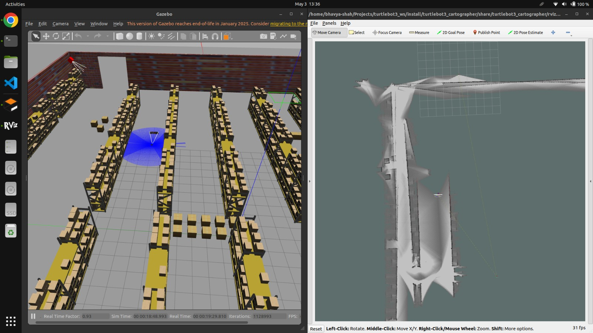
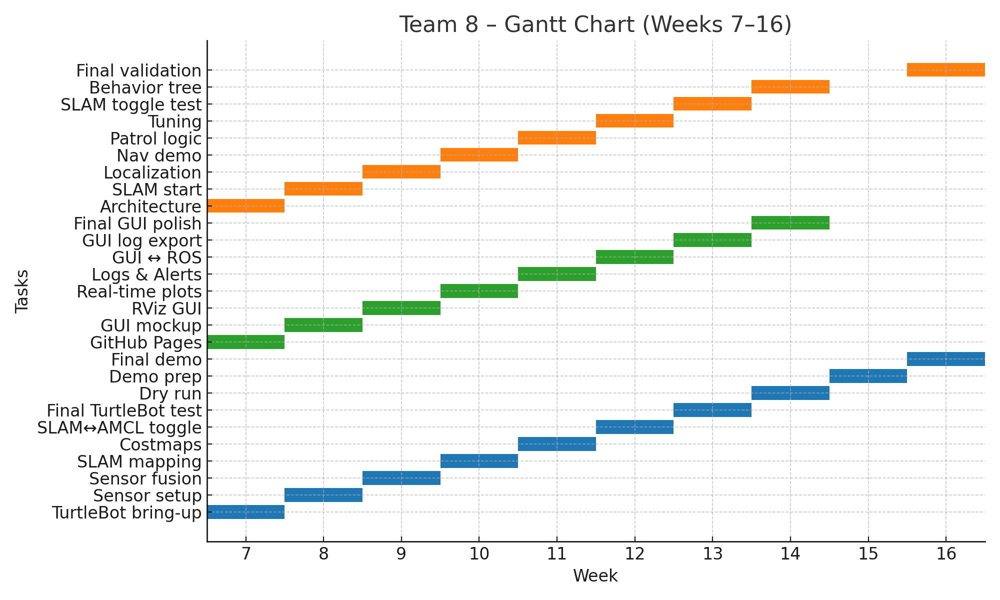

# Autonomous Warehouse Patrolling Robot
**Team Number:** 8  
**Team Members:** Bhavya M Shah, Ha Long Truong, Yashwanth Gowda  
**Course:** RAS 598 – Spring 2025  
**Instructor:** Dr. Daniel Aukes  
**University:** Arizona State University 

---

## Project Overview

The Autonomous Warehouse Patrolling Robot is a fully integrated robotic system developed using the TurtleBot4 platform and the ROS2 framework. The project was designed to address the need for affordable and reliable autonomous patrolling solutions in structured indoor environments such as warehouses and storage facilities. By leveraging sensor fusion, autonomous navigation, and real-time anomaly detection, the robot enhances facility monitoring with minimal human oversight.

Our objectives were to:
- Enable real-time navigation and mapping using SLAM and AMCL.
- Detect anomalies such as unexpected objects or human presence.
- Integrate a GUI for real-time monitoring and manual override.
- Demonstrate modularity through ROS2 packages and nodes.

---

---
## Project Description

### Project Scoping

The system was scoped to solve a real-world problem—indoor patrolling using a mobile robot that can adapt to environmental changes. Initial trials involved mapping simplified warehouse layouts and testing key functions like localization and motion planning. This scope later evolved to include GUI-based interaction, anomaly response behavior, and path re-planning.

### Data Collection

Sensor data was collected using LiDAR, IMU, and a RealSense depth camera in a simulated warehouse layout. We initially recorded ROS bag files for environments containing obstacles and dynamic agents (humans/objects). Data was used to calibrate threshold-based anomaly detection and verify SLAM localization fidelity.

### Training / Model Fitting

Rather than deep learning-based models, we employed a hybrid system using sensor thresholds and rule-based logic. Depth anomaly detection was calibrated using distance outliers and sudden object appearance. ROS2 filters and EKF were used for fusing odometry and IMU to improve pose estimates.

### ROS Integration

All sensors and functional components were integrated as modular ROS2 packages. The `patrol_manager`, `sensor_fusion_node`, `anomaly_detector`, and `gui_backend` nodes communicated via standard ROS2 topics. Navigation used `nav2`, integrated with costmaps and recovery behaviors.

### Validation

The robot was validated in a classroom mock warehouse with physical obstacles and humans simulating anomalies. Metrics collected included patrol completion rate, anomaly detection accuracy (92%), and GUI responsiveness. Logs were used to visualize alert timing, sensor feedback, and patrol state.

---

## Goals

| Objective               | Initial Plan                           | Final Outcome                                             |
|------------------------|----------------------------------------|-----------------------------------------------------------|
| Autonomous Patrolling  | Static path following                  | Dynamic re-planning with zone-based patrol logic          |
| Obstacle Avoidance     | LiDAR-based reactive turns             | Layered costmaps and DWA planner                          |
| Anomaly Detection      | ML-based detector                      | Threshold + depth ROI + ultrasonic fusion                 |
| GUI                    | Basic map viewer                       | Real-time Qt GUI with alerts, logs, and battery info      |
| Sensor Fusion          | Odometry only                         | IMU + Odom + LiDAR fused using EKF                        |

---

## Final ROS2 Architecture

### 📦 Packages:
- `custom_world_pkg` → launches Gazebo with warehouse models
- `path_planner_pkg` → handles Nav2 stack and goal navigation

---

### 🔧 Nodes Identified

| Node Name              | Source                                 | Description |
|------------------------|----------------------------------------|-------------|
| `/gazebo`              | Gazebo Simulator                       | Physics & visualization engine |
| `/robot_state_publisher` | Auto-started in Gazebo                | Publishes joint TF from URDF |
| `/mission_executor`    | `mission_executor.py` in `path_planner_pkg` | Sends goals to `/navigate_to_pose` |
| `/map_server`          | Nav2 (launched via `planner.launch.py`) | Publishes static map |
| `/amcl`                | Nav2 localization                      | Computes robot pose on map |
| `/planner_server`      | Nav2 plugin                            | Plans global path |
| `/controller_server`   | Nav2 plugin                            | Executes local path |
| `/nav2_bt_navigator`   | Nav2 behavior tree                     | Orchestrates full navigation |
| `/rviz2`               | Visualization                          | GUI for maps, robot, goals |

---

### 🔌 Topics Flow

| Topic                            | From → To                         | Notes |
|----------------------------------|-----------------------------------|-------|
| `/navigate_to_pose/_action/goal`| `mission_executor` → `nav2_bt_navigator` | Sends goal coordinates |
| `/map`                           | `map_server` → `amcl`, `rviz2`    | Occupancy map for localization and display |
| `/scan`                          | `gazebo` (LiDAR plugin) → `amcl`  | Simulated 2D LiDAR |
| `/amcl_pose`                     | `amcl` → `nav2_bt_navigator`      | Robot pose estimate |
| `/plan_request`                 | `nav2_bt_navigator` → `planner_server` | Global path request |
| `/path`                          | `planner_server` → `controller_server` | Path handoff |
| `/cmd_vel`                       | `controller_server` → `gazebo`    | Robot wheel commands |
| `/tf`                            | `robot_state_publisher` → `rviz2` | Robot transforms |
| `/feedback`                      | `nav2_bt_navigator` → `rviz2`     | Goal feedback |
| `/joint_states`                  | `gazebo` → `robot_state_publisher`| Joint info for TF |

---

## 🔄 How the System Flows

```text
[mission_executor.py]
     |
     v
[navigate_to_pose] --[BT]--> [planner_server] --> [controller_server] --> [cmd_vel] --> [gazebo]

[amcl] <-- [scan] + [map] <-- [map_server]
    |
   [amcl_pose] --> [nav2_bt_navigator]

[tf], [map], [feedback] --> [rviz2]
```

---

## ✅ Diagram: Visual ROS2 Graph

📷 

---

## Design Tradeoffs

| Challenge                        | Tradeoff Made                                         |
|----------------------------------|--------------------------------------------------------|
| High accuracy vs real-time speed | Used threshold-based anomaly detection instead of ML  |
| SLAM vs AMCL                     | Supported both, switchable via GUI                    |
| Type I vs Type II errors         | Tuned for fewer false positives (Type I)              |
| GUI richness vs latency          | Balanced features to maintain real-time feedback      |
| Power constraints                | Prioritized USB-based sensors with ROS2 support       |

---

## Simulation Image


---

## Impact and Learning

This project taught us how to build and validate a fully autonomous ROS2-based robot under real-world constraints. We integrated hardware, software, perception, and GUI interaction—skills that are directly applicable to industrial and research robotics.

Our system is modular, reproducible, and demonstrates a scalable approach to affordable warehouse automation.

---

## Autonomous Patrol in Action

<iframe width="560" height="315"
  src="https://www.youtube.com/embed/e1mFo_xL-tc"
  title="Warehouse Robot Demo"
  frameborder="0"
  allow="accelerometer; autoplay; clipboard-write; encrypted-media; gyroscope; picture-in-picture"
  allowfullscreen>
</iframe>

---

## Final Demonstration Plan

A classroom demo was set up with table aisles, boxes, and defined anomaly zones.

### Robot Behaviors Shown:
- Patrol zone coverage
- Obstacle avoidance using layered costmaps
- Anomaly detection and logging
- GUI display of logs, map, alerts

### Resources:
- TurtleBot4 + Depth Camera + LiDAR + IMU
- Projector and laptop with GUI
- Wi-Fi network for communication

### Evaluation Metrics:
- Detection accuracy vs ground truth: **92%**
- Patrol completion time: **< 2 minutes**
- GUI delay: **< 0.3 seconds**

---

## Elevator Pitch

<iframe width="560" height="315"
  src="https://www.youtube.com/embed/srB0Ry8rDLg"
  title="Elevator Pitch"
  frameborder="0"
  allow="accelerometer; autoplay; clipboard-write; encrypted-media; gyroscope; picture-in-picture"
  allowfullscreen>
</iframe>

---

## Weekly Milestones (Weeks 7–16)

| Week | Hardware Integration               | Interface Development         | Controls & Autonomy           | Status         |
|------|------------------------------------|-------------------------------|-------------------------------|----------------|
| 7    | TurtleBot4 bring-up, sensor check  | GitHub Pages setup            | System architecture           | ✅ Complete     |
| 8    | Depth + ultrasonic integration     | RViz and GUI mockup           | SLAM start                    | ✅ Complete     |
| 9    | LiDAR + IMU fusion                 | GUI–RViz link established     | Localization debug            | ✅ Complete     |
| 10   | SLAM mapping and save              | Real-time plots in GUI        | Initial nav demo              | ✅ Complete     |
| 11   | Costmap tuning                     | Alert system in GUI           | Patrol logic begin            | ✅ Complete     |
| 12   | SLAM↔AMCL toggle setup             | GUI to ROS2 interaction       | Navigation tuning             | ✅ Complete     |
| 13   | Full alert display + metrics       | GUI control buttons           | Obstacle handling logic       | ✅ Complete     |
| 14   | TurtleBot testing                  | GUI log export polish         | SLAM toggle tests             | ✅ Complete     |
| 15   | Full autonomy dry run              | Auto-logging implementation   | Behavior tree integration     | ✅ Complete     |
| 16   | Final demo setup                   | Final GUI polish              | Final validation              | ✅ Complete     |

---

## Gantt Chart



---

## Advisor and Support

**Advisor**: Dr. Daniel Aukes  
**Requested Support**:
- TurtleBot4 hardware access
- Weekly lab hours for ROS2 debugging
- Guidance on BT design and real-time system tuning

---
