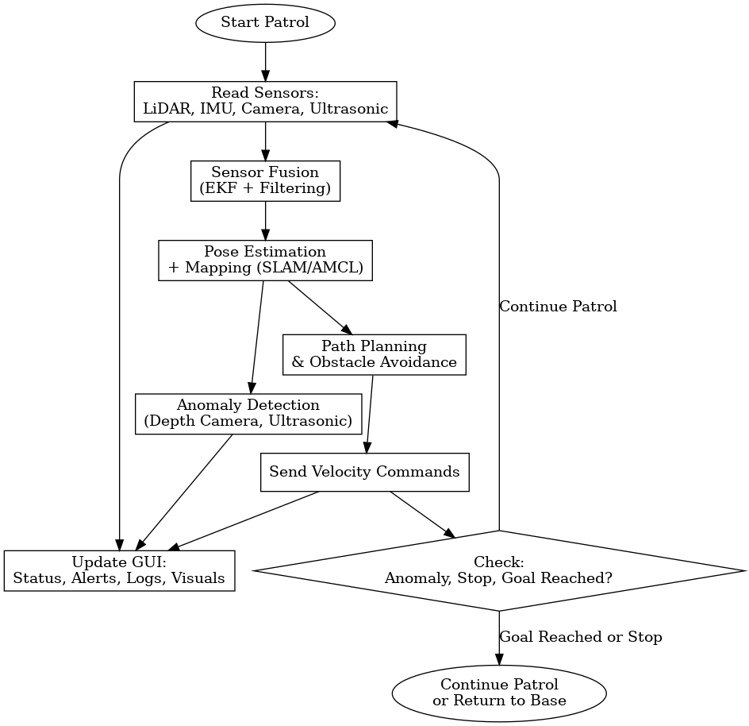

# Autonomous Warehouse Patrolling Robot

---

Project Name: Autonomous Warehouse Patrolling Robot.

Team Number: Team 8.

Team Members: Bhavya M Shah, Ha Long Truong, Yashwanth Gowda.

Semester and Year: Spring 2025.

University, Class, Professor: Arizona State University, RAS 598, Dr. Aukes.

---

## Team Project Plan

Our project centers around the design and implementation of an Autonomous Warehouse Patrolling Robot utilizing the TurtleBot4 platform, integrated with the Robot Operating System 2 (ROS2) framework. The overarching goal is to develop a scalable, low-cost robotic solution capable of performing real-time patrolling tasks in structured indoor environments such as warehouses or storage facilities.

**Research Question**:  
How can we leverage low-cost mobile robotics platforms to achieve reliable autonomous patrolling in structured indoor warehouse environments, with real-time anomaly detection and environmental adaptability?

This research question drives us to explore and implement a range of robotics technologies and concepts, particularly focusing on the integration of multiple sensor modalities (such as LiDAR, IMU, depth camera, and odometry), robust control algorithms, and autonomy pipelines that balance reactive behavior (e.g., obstacle avoidance) with deliberative planning (e.g., patrol route optimization).

By simulating realistic warehouse conditions, our project will investigate the following:

- Multi-Sensor Fusion: Combining data from various onboard sensors to generate a coherent model of the robot’s environment and enhance localization, mapping, and situational awareness.
  
- Autonomous Navigation & Patrolling: Implementing SLAM (Simultaneous Localization and Mapping) techniques alongside path planning algorithms to enable the robot to patrol pre-defined or dynamically generated routes.

- Real-Time Anomaly Detection: Using sensory input (such as depth and visual cues) to detect unexpected objects, humans, or hazards in the robot’s path or assigned patrol zones.

- Interactive System Monitoring: Developing a custom graphical user interface (GUI) to display live robot status, environment mapping, anomaly alerts, and control interfaces for manual override or remote supervision.

- Environmental Adaptability: Equipping the robot with the capability to adapt its behavior based on changing conditions such as blocked paths, dynamic obstacles, or signal loss, ensuring robustness in real-world applications.

                                                
Our approach aims not only to implement a working prototype of a patrolling robot but also to provide a generalized framework for deploying autonomous agents in structured environments. Ultimately, this project aspires to demonstrate how affordable hardware combined with modular software architecture can address real-world operational needs in industrial settings — with potential extensions into areas like inventory monitoring, safety inspection, and collaborative automation.

## Sensor Integration

Sensor integration lies at the core of our Autonomous Warehouse Patrolling Robot’s functionality, enabling perception, localization, navigation, and real-time decision-making. Our approach involves the strategic fusion of multiple sensor modalities, each contributing complementary data that enhances the robot’s understanding of its environment and its ability to operate reliably in dynamic warehouse settings.

We integrate a suite of sensors to support localization, perception, and safety. Each sensor contributes distinct yet complementary information:

- **2D LiDAR** for SLAM and obstacle mapping.
- **Depth Camera** for object and human detection.
- **IMU** for pose stability during motion.
- **Ultrasonic Sensors** for short-range obstacle alerts.

**In code**:  
Sensor data is streamed through individual ROS2 nodes and fused using the robot_localization package to estimate pose. Filters like moving averages and EKFs are used for smoothing.

**In testing**:  
We will visualize real-time sensor streams in RViz2, calibrate thresholds, and verify detection algorithms.

**In final demonstration**:  
Sensor data will guide navigation, trigger reactive behaviors (e.g., avoid obstacle), and inform the GUI of real-time statuses and anomalies.

## Interaction Plan

Each sensor will be managed through dedicated ROS2 nodes, ensuring modularity, scalability, and real-time communication via ROS topics. We will influence robot behavior through both autonomous logic and manual controls:

- **GUI Interface** (Python Qt + rqt):
  - Displays live patrol map and status
  - Visual alerts for anomalies or obstacles
  - Manual override buttons (pause, replan, resume)
  - System logs (distance, battery, alerts)

- **User Overrides**:
  - Keyboard input for debugging
  - (Optional) Voice commands for commands like “start patrol” or “return to base”

## Control and Autonomy

The autonomous capabilities of the warehouse patrolling robot are achieved through a carefully structured, layered control system. This hierarchical architecture allows for robust and adaptable operation, enabling the robot to navigate complex warehouse environments, react to unforeseen circumstances, and execute its patrolling mission effectively.We implement a **layered control architecture**:

1. Low-Level Control: Precise Motion Execution
At the foundational layer lies the low-level control system. This layer is responsible for the precise execution of motion commands sent by higher-level controllers. It directly interfaces with the robot's actuators, primarily the wheel motors.

-	Wheel Velocity Commands: The primary function of this layer is to translate desired linear and angular velocities into individual wheel velocity commands. This involves kinematic models that account for the robot's geometry and wheel configuration.

-	Odometry Feedback: To ensure accurate motion, the low-level controller relies on odometry feedback. Data from wheel encoders (or other internal sensors) is used to estimate the robot's current pose (position and orientation).

-	Goal: The primary goal of the low-level control is to ensure smooth, accurate, and stable robot motion according to the commands received from the mid-level controller.

2. Mid-Level Control: Reactive Navigation and Safety
The mid-level control system builds upon the capabilities of the low-level layer, focusing on the robot's interaction with its immediate surroundings and ensuring safe navigation.

-	Obstacle Avoidance: This is a critical function of the mid-level control. By processing real-time data from the robot's suite of sensors (LiDAR, depth camera, ultrasonic sensors), this layer detects obstacles in the robot's path.

-	Reactive Behaviors: Based on the sensor data, the mid-level controller implements reactive behaviors to avoid collisions. These behaviors might include slowing down, stopping, turning, or maneuvering around obstacles. Algorithms like Vector Field Histogram (VFH), Dynamic Window Approach (DWA), or similar reactive planning techniques are typically employed.

3. High-Level Autonomy: Intelligent Mission Execution
The high-level autonomy system orchestrates the robot's overall mission, enabling it to perform complex tasks without continuous human intervention.

-	Patrol Routing: This layer utilizes a pre-mapped representation of the warehouse, dividing it into logical zones or waypoints. Based on the desired patrol strategy (e.g., sequential zone coverage, prioritized areas), the high-level controller generates a sequence of target locations or paths for the robot to follow.

-	Behavior Trees: Behavior trees provide a powerful and modular framework for defining the robot's high-level behaviors and decision-making processes. They allow for the representation of complex sequences, conditional actions, and parallel tasks involved in the patrolling mission (e.g., navigate to zone A, scan for anomalies, log data, proceed to zone B).

-	ROS2 Navigation Stack Integration: The robot leverages the ROS2 Navigation stack, a robust and widely used framework for mobile robot navigation. This stack provides pre-built functionalities for path planning, obstacle avoidance, localization, and map management.

- Autonomous Decision-Making: The high-level system enables the robot to make autonomous decisions regarding patrol routes based on factors like time, priority, or previously detected anomalies.

- Dynamic Path Re-planning: If the mid-level control encounters an unforeseen obstacle that blocks the planned path, the high-level autonomy system can trigger path re-planning. Utilizing the current map and the robot's current location, the Navigation stack can compute a new, feasible path to reach the original goal or the next patrol waypoint.

- Anomaly Detection Integration: This layer will also integrate with the robot's perception system to process anomaly detection results. Upon detecting an anomaly, the high-level controller can deviate from the standard patrol route to investigate, log the event, and potentially trigger alerts.

In summary, the layered control and autonomy system allows the warehouse patrolling robot to:
- Execute precise movements based on high-level commands (low-level control).
- Navigate safely and reactively to dynamic environments by avoiding obstacles (mid-level control).
- Intelligently plan and execute patrol missions based on pre-defined strategies and adapt to changing circumstances (high-level autonomy).
- Leverage the power of ROS2 Navigation for robust path planning and navigation capabilities.

This sophisticated control architecture ensures that the robot can effectively and efficiently perform its warehouse patrolling tasks, enhancing security, safety, and operational awareness within the facility.

## Preparation Needs

To execute this project successfully, we need a solid grasp of:

- ROS2 Navigation Stack configuration
- Multi-sensor data fusion techniques (especially IMU + LiDAR)
- Behavior Tree design for high-level autonomy
- GUI development using rqt and Python Qt
- Real-time debugging in ROS2

**Topics we would like covered in class**:

- Detailed walkthrough of the ROS2 Navigation Stack
- Practical debugging tools for real-time sensor streams
- Examples of robust behavior trees in ROS2

## Final Demonstration Plan

Our final demonstration is designed to showcase the full capabilities of the Autonomous Warehouse Patrolling Robot, developed using the TurtleBot4 platform and ROS2. The demo will simulate a realistic indoor warehouse environment using a scaled mockup constructed within a classroom. This hands-on trial will allow observers to evaluate the robot’s ability to autonomously patrol, avoid obstacles, detect anomalies, and present live system data through a custom-built graphical user interface (GUI).

**Demo Description**

During the demonstration, TurtleBot4 will autonomously navigate through a mock warehouse layout configured using tables, cardboard boxes, and tape-marked pathways. It will:

-	Perform a patrol loop based on predefined waypoints.
-	Use sensor data from LiDAR, depth camera, IMU, and ultrasonic sensors to perceive and react to the environment.
-	Avoid obstacles (both static and dynamic) in real-time.
-	Provide live telemetry and visualization on a projector-based GUI that displays:
*	Real-time map (from RViz)
*	Robot position and path
*	Obstacle alerts
*	Anomaly flags (e.g., unexpected objects or human detection)

The demo will highlight key features such as localization accuracy, real-time responsiveness, safety, and user interaction.

**Resources Needed:**

- TurtleBot4 with LiDAR, depth camera, IMU
- Classroom space with mock warehouse (tables, boxes, marked paths)
- Projector to display GUI
- Wi-Fi for robot-to-GUI communication

**Classroom Setup:**

- Tables and cardboard boxes simulate shelves
- Marked patrol lanes with tape
- Defined “anomaly zones” using objects or people
- Central station (laptop) for GUI + RViz display

**Handling Environmental Variability:**

- AMCL will adapt pose estimation in dynamic environments
- Dynamic costmaps will update routes in real-time if obstacles appear
- Redundant sensors help maintain perception during partial failure

**Testing & Evaluation Plan:**

- **Unit testing** of individual sensor streams and nodes
- **Functional testing** of integrated navigation + anomaly detection
- **Live metrics**:
  - Patrol coverage (zones visited)
  - Anomaly detection rate vs ground truth
  - Obstacle response time
  - GUI responsiveness and feedback clarity

Video recording and real-time logging will be used to analyze performance and validate mission success.

## Impact Statement

This project challenges us to integrate real-world robotics technologies under constraints of hardware, cost, and usability. It will deepen our knowledge of robotic system design, especially in areas of:

- Modular ROS2 software design
- Sensor data conditioning and fusion
- Real-time autonomy and safety layers
- Visual interface development

It serves as a testbed for future coursework in robotics, simulation, and industrial automation—and could evolve into a deployable solution for safety inspection or inventory monitoring. And we try to push full autonomy (BT integration) by one week to refine SLAM + costmap tuning.

## Sensor Data Conditioning, Filtering, and Utilization

We implemented the following for sensor data:

| **Sensor** | **Strategy** |
| --- | --- |
| **LiDAR** | Clipping to range \[0.2m–3.5m\], outlier rejection, smoothing via rolling mean |
| **IMU** | Filtered with ROS2 robot_localization EKF using /imu/data |
| **Depth Camera** | Depth masking to ignore floor reflections and reduce noise; regions-of-interest for anomaly detection |

All filtered sensor data feeds into:

- **local costmap** (for obstacle avoidance)
- **global planner** (for patrol path planning)
- **GUI** (for live monitoring and safety)

## Sensor Fusion for Low-Level and High-Level Decisions

- **Fusion Pipeline Overview**:

- **Low-Level**: EKF → Odometry + IMU → Controls
- **High-Level**: Depth anomalies + patrol planner → path updates and alerts

## ROS2 Node Architecture and Topic Mapping

**Node Overview**:

- realsense2_camera_node → /camera/depth/image_raw
- rplidar_ros2_node → /scan
- micro_ros_node (ultrasonic) → /ultrasonic_range
- robot_localization EKF → /odom, /imu/data
- move_base_flex (nav stack)
- patrol_manager_node (custom)
- anomaly_detector_node (custom)
- gui_backend_node → /gui/logs, /gui/alerts, /gui/status

## GUI Real-Time Sensor Data (Live Demo Progress)

We’ve implemented GUI elements that:

- Plot live LiDAR scans
- Highlight current patrol zone on map
- Flag anomalies
- Log battery level, patrol duration, and distance

<iframe width="560" height="315" src="https://www.youtube.com/embed/p81DixPODpc&list=PL4e6DWX5mZvaRTcvywfToLrumtm3tlkBI&index=1" title="GUI Real Time Sensor Data" frameborder="0" allow="accelerometer; autoplay; clipboard-write; encrypted-media; gyroscope; picture-in-picture" allowfullscreen> </iframe>

Video Requirement: https://youtube.com/playlist?list=PL4e6DWX5mZvaRTcvywfToLrumtm3tlkBI&si=JJDVAatZlTniiuUw   

## Simulation

## Navigation
<iframe width="560" height="315" src="https://www.youtube.com/embed/e1mFo_xL-tc" title="Warehouse Robot Demo" frameborder="0" allow="accelerometer; autoplay; clipboard-write; encrypted-media; gyroscope; picture-in-picture" allowfullscreen> </iframe>
https://youtu.be/e1mFo_xL-tc

## Advising

**Advisor**: Dr. Aukes
**Requested Support**:
- Access to TurtleBot4 and lab space
- Weekly mentoring sessions
- Guidance on advanced ROS2 usage

**Weekly Milestones (Weeks 7–16)**

## 📋 Weekly Milestones Table (Aligned with Assignments)
# 📅 Weekly Milestones Table (Simplified)

| Week     | Hardware Integration                         | Interface Development                         | Controls & Autonomy                           | Assignment Focus / Deliverable                         | Status         |
|----------|-----------------------------------------------|-----------------------------------------------|------------------------------------------------|--------------------------------------------------------|----------------|
| Week 7   | TurtleBot4 bring-up, sensor validation        | Set up GitHub Pages, basic project website     | Define system architecture                     | 🟢 **Team Assignment 1**: Concept, goals, UI mockup     | ✅ Complete     |
| Week 8   | Depth camera, ultrasonic sensor setup         | RViz mockup, GUI layout draft                  | SLAM stack intro                               | 🟢 TA1 continued: Planning + visuals                    | ✅ Complete     |
| Week 9   | Sensor fusion (LiDAR+IMU+Odom)                | GUI RViz integration                           | Localization tested with fusion                | 🟢 TA1 final touches, prepare for SLAM                  | ✅ Complete     |
| Week 10  | SLAM + map saving setup                       | Real-time plots in GUI                         | SLAM navigation working demo                   | 🟢 **Team Assignment 2**: SLAM results, depth integration| ✅ Complete     |
| Week 11  | Costmap layers setup                          | GUI updates: status log, alerts                | Patrol logic implementation                    | 🟢 TA2 submission; begin full behavior testing          | ✅ Complete     |
| Week 12  | Mode toggle prep (SLAM ↔ AMCL)                | Full GUI → ROS interaction                     | Navigation tuning                              | 🟢 **Team Assignment 3**: Data filtering, GUI integration| ✅ Complete     |
| Week 13  | GUI live display (alerts, metrics)            | GUI control (pause/resume, alerts)             | Replanning & manual override                   | 🟠 TA3 wrap-up; polish before dry-run                   | 🔄 In Progress  |
| Week 14  | TurtleBot full integration (real test)        | Export GUI logs, feedback polish               | SLAM vs AMCL toggle test                        | 🟠 Begin **Team Assignment 4**: Testing + autonomy       | 🔄 In Progress  |
| Week 15  | Full autonomy dry run + backups               | Auto-logging, restart controls                 | Behavior tree + fault handling                 | 🔘 TA4 final polish; prepare for live demo              | ⬜ Not Started  |
| Week 16  | In-class demo setup                           | Final GUI build and docs                       | Final validation: autonomy + GUI monitoring    | 🎯 Final deliverables submission + demo                 | ⬜ Not Started  |

---

**✅ Status Key:**

- ✅ **Complete** (Weeks 7–12)
- 🔄 **In Progress** (Weeks 13–14)
- ⬜ **Not Started** (Weeks 15–16)
