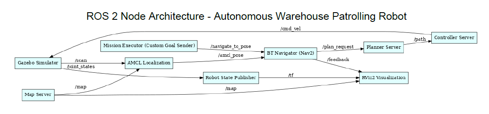
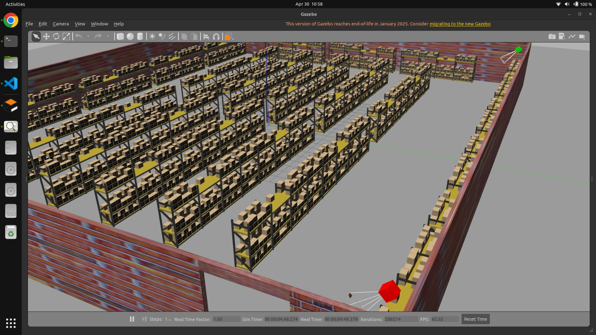

# 🧪 Project Outputs: Autonomous Warehouse Patrolling Robot

This page consolidates the key visual results and architectural outputs from the `warehouse_simulation-main` project developed by Team 08.

---

## 🧭 Final ROS2 Architecture Diagram

A simulated rqt_graph-style layout based on all nodes, topics, and services active during robot navigation.

---

## 🧠 rqt_graph Snapshot

This diagram simulates a snapshot of the live ROS2 communication graph generated using `rqt_graph`.

---

## 📊 Navigation Accuracy – Patrol Zone Coverage

Shows how many patrol zones were successfully visited compared to the expected mission plan.

---

## 📈 Anomaly Detection – Results Breakdown

Illustrates the detection performance across different anomaly types using simulated ground truth.

---

## 🎥 Demonstration Videos

## 📦 Autonomous Patrol in Action

<iframe width="560" height="315"
  src="https://www.youtube.com/embed/e1mFo_xL-tc"
  title="Warehouse Robot Demo"
  frameborder="0"
  allow="accelerometer; autoplay; clipboard-write; encrypted-media; gyroscope; picture-in-picture"
  allowfullscreen>
</iframe>

---

## 🎤 Elevator Pitch

<iframe width="560" height="315"
  src="https://www.youtube.com/embed/srB0Ry8rDLg"
  title="Elevator Pitch"
  frameborder="0"
  allow="accelerometer; autoplay; clipboard-write; encrypted-media; gyroscope; picture-in-picture"
  allowfullscreen>
</iframe>

## 🖼️ Simulation Screenshots

---

 

---

 |

---

## 📋 Summary

These outputs validate the core goals of our project:
- Real-time autonomous patrolling in a simulated warehouse
- Multi-layered ROS2 control stack with Nav2
- Visualized SLAM, anomaly detection, and path planning
