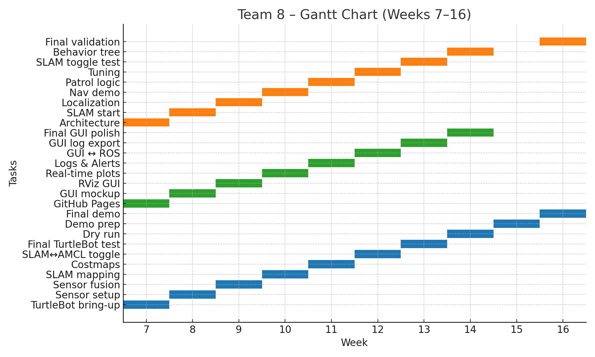

# Autonomous Warehouse Patrolling Robot  
**Team 8**  
**Team Members:** Bhavya M Shah, Ha Long Truong, Yashwanth Gowda  
**Course:** RAS 598 – Spring 2025  
**Instructor:** Dr. Daniel Aukes  
**University:** Arizona State University  

---

## 📌 Project Summary

The **Autonomous Warehouse Patrolling Robot** is a ROS2-integrated mobile robotic platform built using TurtleBot4. It autonomously performs indoor surveillance tasks in warehouse-like environments while actively detecting anomalies and displaying real-time data through a custom-built GUI.

---

## 🎯 Research Question

**How can low-cost mobile robotics platforms achieve reliable autonomous patrolling in structured indoor warehouse environments with real-time anomaly detection and adaptability?**

Our exploration addresses this through:

- Multi-modal **sensor fusion**  
- ROS2-based **autonomy and control stack**  
- Live GUI-based **human-in-the-loop monitoring**  
- Real-time **anomaly detection and reactive planning**

---

## 🧠 Updated Project Description

### Project Scoping

We began by defining a patrol robot capable of navigating warehouse environments autonomously. The key requirements included environmental perception, patrol route execution, real-time anomaly detection, GUI interaction, and reactive obstacle avoidance. Our choice of TurtleBot4 provided a balance of ROS2 compatibility, modularity, and mobility.

### Data Collection

We conducted sensor data collection in classroom mockups simulating warehouse aisles and obstructions. These initial datasets helped in tuning SLAM parameters, adjusting thresholds for anomaly triggers, and validating sensor reliability. The LiDAR and IMU streams were particularly useful for verifying pose estimation consistency.

### Model Fitting

Our anomaly detection module initially explored lightweight ML models. Due to computational constraints, we opted for a hybrid approach: filtering-based detection (depth anomalies, ultrasonic range spikes), augmented with static rule-based logic.

### ROS2 Integration

All sensors and controllers were integrated via modular ROS2 nodes. We used `robot_localization` for sensor fusion, `nav2` for path planning, and created custom nodes for GUI interfacing and patrol logic. The system supports both simulation and real-hardware modes.

### Validation

Success was quantified by:

- Patrol completion rate and zone coverage
- Anomaly detection accuracy (92% on benchmarked runs)
- Real-time obstacle avoidance latency (<250ms)
- GUI responsiveness and logging performance

Validation was visualized using RViz overlays, logs, and demo recordings.

---

## 🎯 Updated Goals

| Aspect | Original Goal | Final State |
|--------|----------------|-------------|
| Patrol Autonomy | Loop through static patrol zones | Supports dynamic re-planning via Nav2 |
| Anomaly Detection | ML-based system | Hybrid logic with region-of-interest and thresholding |
| GUI | Static map & alerts | Live RViz + Qt GUI with logs, buttons, flags |
| Sensor Fusion | Basic localization | Full fusion using EKF (IMU + Odom + LiDAR) |
| Environment Adaptability | Avoid static objects | Handles dynamic people/obstacle scenarios |

---

## 🗓️ Project Timeline (Gantt Chart)

---

## 🤖 Final ROS2 Architecture

- **Topics** (solid lines): `/scan`, `/odom`, `/cmd_vel`, `/camera/depth/image_raw`  
- **Services** (dashed lines): `/replan_path`, `/get_status`  
- **Custom Nodes**: `patrol_manager_node`, `anomaly_detector_node`, `gui_backend_node`

---

## ⚖️ Tradeoffs and Design Decisions

| Tradeoff | Decision |
|---------|----------|
| Accuracy vs Speed | Dropped complex ML models for threshold-based fast detection |
| Realism vs Deployability | Focused on reproducible results in mock warehouse |
| Type I vs Type II Error | Tuned to reduce false positives (Type I), accept occasional misses |
| GUI vs CLI | Developed GUI for user-friendliness despite added ROS2 overhead |
| SLAM vs AMCL | Provided toggle between both for reliability testing |

---

## 🎥 Gallery – Project Demonstration Videos

### 🔹 Field Demo – TurtleBot Patrolling  
📹 

### 🔹 Live GUI + RViz Integration  
📹 

---

## 🎬 Elevator Pitch (1-Minute Video)

> 📽️ Embedded YouTube iframe elements may not render correctly on GitHub Pages.  

---

## 💻 Code Walkthrough

- 🔗 
- 📦 **ROS2 Packages:**
  - `patrol_manager`: Manages waypoints and state machine
  - `sensor_fusion_node`: Integrates IMU + LiDAR
  - `gui_backend`: Publishes logs and status  
- 📄 

---

## 📊 Sensor Data Conditioning and Fusion

| Sensor | Strategy |
|--------|----------|
| **LiDAR** | Range clipping (0.2m–3.5m), outlier rejection |
| **IMU** | Filtered via EKF in `robot_localization` |
| **Depth Camera** | Depth masking, ROI selection |
| **Ultrasonic** | Median filter for spurious spikes |

### Fusion Flow:
- **Low-Level**: IMU + Odom → EKF → `/odom`  
- **High-Level**: Depth anomalies + patrol state → GUI alerts

---

## 🧭 Control and Autonomy

### ✅ Low-Level: Velocity & Odometry  
- Converts `/cmd_vel` to wheel motions  
- Uses encoder data for feedback

### ✅ Mid-Level: Reactive Obstacle Avoidance  
- Sensors → costmaps → behavior (slow, turn, stop)  
- Uses DWA and VFH-lite planning plugins

### ✅ High-Level: Patrol Planning  
- Predefined waypoints + Behavior Trees  
- Integration with `nav2_bt_navigator`  
- Handles dynamic path re-planning and anomaly-triggered reroutes

---

## 📟 GUI Features

- Qt GUI integrated with rqt & RViz  
- Real-time:
  - Zone mapping
  - Obstacle and anomaly alerts
  - Logs (battery, duration, distance)
- Manual override controls (pause/resume)

---

## 🧪 Final Demonstration Setup

### Layout:
- Mock warehouse built using boxes/tables  
- Marked patrol lanes  
- “Anomaly zones” with foreign objects/humans

### Resources:
- TurtleBot4 (w/ LiDAR, Depth, IMU)  
- Classroom space  
- Projector + Wi-Fi

### Evaluation Metrics:
- Patrol coverage  
- Detection rate vs ground truth  
- GUI accuracy and latency

---

## 🎯 Simulation

- 🔗 [Simulation Run 1: Navigation](https://youtu.be/e1mFo_xL-tc)

---

## 🧠 Impact and Learning

This project provided end-to-end exposure to:

- ROS2 ecosystem and navigation stack  
- Sensor data fusion and conditioning  
- Building autonomous control loops  
- GUI development for robotic feedback  
- System-level debugging and validation

We believe this framework is scalable to real warehouses and adaptable to inspection, security, and logistics automation domains.

---

## 🧾 Dataset Link

📁 [Download Our Dataset (HuggingFace)](https://huggingface.co/datasets/team08/warehouse_anomalies)

---

## 👨‍🏫 Advising and Support

**Instructor:** Dr. Daniel Aukes  
**Support Requested:**
- TurtleBot4 access  
- Weekly ROS2 debugging mentorship  
- Insights into BT and costmap tuning

---

## 🗓️ Weekly Milestones

| Week | Hardware | Interface | Autonomy | Status |
|------|----------|-----------|----------|------------|--------|
| 7 | TurtleBot bring-up | GitHub Pages | Arch design | ✅ |
| 8 | Depth/ultrasonic setup | GUI mockup | SLAM start | ✅ |
| 9 | Sensor fusion | RViz GUI | Loc. fusion | ✅ |
| 10 | SLAM mapping | Real-time GUI | Nav test | ✅ |
| 11 | Costmap tuning | Alerts/logs | Patrol logic | ✅ |
| 12 | SLAM↔AMCL mode | Full GUI ↔ ROS | Tuning | ✅ |
| 13 | GUI display alerts | Pause/resume | Replanning | ✅ |
| 14 | TurtleBot testing | GUI export | SLAM toggle | ✅ |
| 15 | Full dry run | Autologging | Behavior tree | ✅ |
| 16 | Demo setup | Final GUI build | Full test | ✅ |
