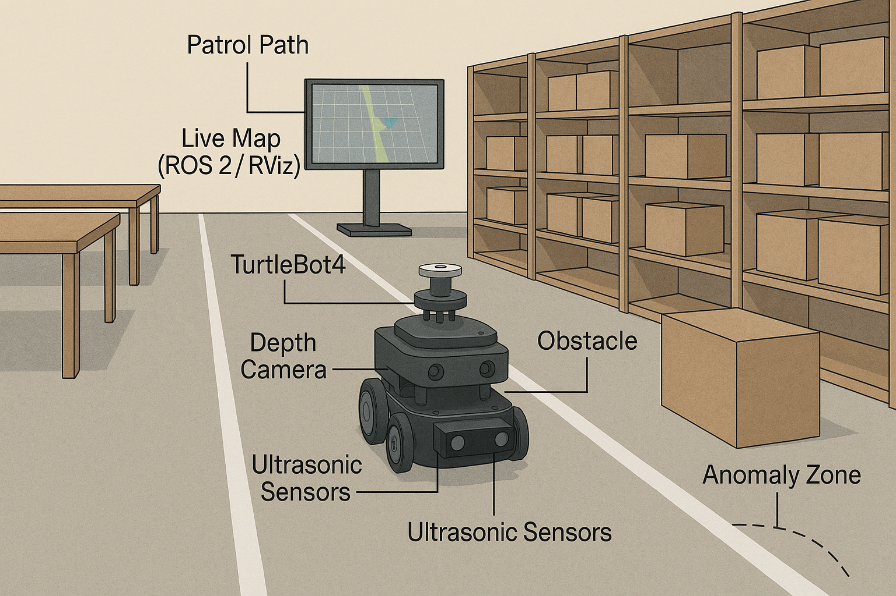
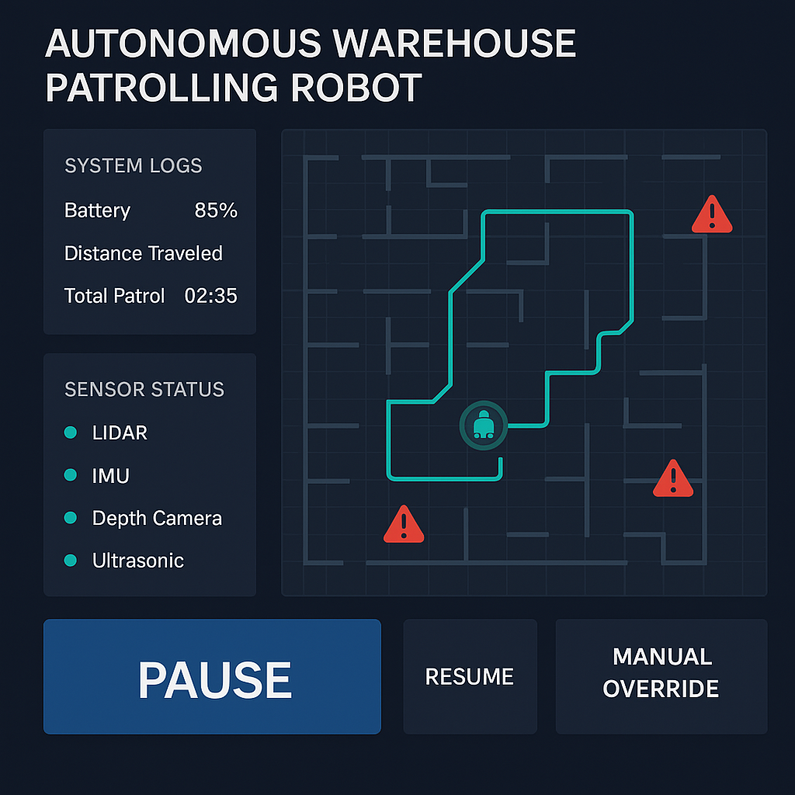
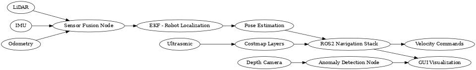

**Autonomous Warehouse Patrolling Robot**

Project Name: Autonomous Warehouse Patrolling Robot

Team Number: Team 8

Team Members: Bhavya M Shah, Ha Long Truong, Yashwanth Gowda

Semester and Year: Spring 2025

University, Class, Professor: Arizona State University, RAS 598, Dr. Aukes

**Team Project Plan**

Our team aims to design and implement an **Autonomous Warehouse Patrolling Robot** using the TurtleBot4 platform and ROS2. This robot will autonomously navigate and patrol indoor warehouse-like environments while detecting anomalies, avoiding obstacles, and reporting real-time status through a custom graphical user interface (GUI).

**Research Question**:  
_How can low-cost mobile robotics platforms be utilized for reliable autonomous patrolling in indoor environments, combining real-time perception, decision-making, and interactive monitoring?_

A Visualization

This project explores the intersection of autonomous navigation, sensor fusion, real-time anomaly detection, and user interface development.

We now focus more on robust **sensor fusion** and **reactive re-planning**. We scaled back voice control to a future extension due to time constraints. Anomaly detection will focus on static object and human detection using simple depth thresholds, not deep-learning vision.

**Sensor Integration**

We integrate a suite of sensors to support localization, perception, and safety. Each sensor contributes distinct yet complementary information:

- **2D LiDAR** for SLAM and obstacle mapping.
- **Depth Camera** for object and human detection.
- **IMU** for pose stability during motion.
- **Ultrasonic Sensors** for short-range obstacle alerts.

**In code**:  
Sensor data is streamed through individual ROS2 nodes and fused using the robot_localization package to estimate pose. Filters like moving averages and EKFs are used for smoothing.

**In testing**:  
We will visualize real-time sensor streams in RViz2, calibrate thresholds, and verify detection algorithms.

**In final demonstration**:  
Sensor data will guide navigation, trigger reactive behaviors (e.g., avoid obstacle), and inform the GUI of real-time statuses and anomalies.

A Flowchart demonstrating the project work.

**Interaction Plan**

We will influence robot behavior through both autonomous logic and manual controls:

- **GUI Interface** (Python Qt + rqt):
  - Displays live patrol map and status
  - Visual alerts for anomalies or obstacles
  - Manual override buttons (pause, replan, resume)
  - System logs (distance, battery, alerts)

- **User Overrides**:
  - Keyboard input for debugging
  - (Optional) Voice commands for commands like “start patrol” or “return to base”

Sample GUI Mockup

**Control and Autonomy**

We implement a **layered control architecture**:

- **Low-level Control**: Direct wheel velocity and motion via odometry.
- **Mid-level Control**: Obstacle avoidance using VFH/DWA.
- **High-level Autonomy**:
  - Patrol routing using pre-defined waypoints
  - Decision-making via Behavior Trees
  - Dynamic re-planning in case of blocked paths
  - Anomaly detection integration and behavior changes based on events

All control layers are connected through ROS2's Navigation Stack with AMCL for localization.

**Preparation Needs**

To execute this project successfully, we need a solid grasp of:

- ROS2 Navigation Stack configuration
- Multi-sensor data fusion techniques (especially IMU + LiDAR)
- Behavior Tree design for high-level autonomy
- GUI development using rqt and Python Qt
- Real-time debugging in ROS2

**Topics we would like covered in class**:

- Detailed walkthrough of the ROS2 Navigation Stack
- Practical debugging tools for real-time sensor streams
- Examples of robust behavior trees in ROS2

**Final Demonstration Plan**

**Resources Needed:**

- TurtleBot4 with LiDAR, depth camera, IMU
- Classroom space with mock warehouse (tables, boxes, marked paths)
- Projector to display GUI
- Wi-Fi for robot-to-GUI communication

**Classroom Setup:**

- Tables and cardboard boxes simulate shelves
- Marked patrol lanes with tape
- Defined “anomaly zones” using objects or people
- Central station (laptop) for GUI + RViz display

**Handling Environmental Variability:**

- AMCL will adapt pose estimation in dynamic environments
- Dynamic costmaps will update routes in real-time if obstacles appear
- Redundant sensors help maintain perception during partial failure

**Testing & Evaluation Plan:**

- **Unit testing** of individual sensor streams and nodes
- **Functional testing** of integrated navigation + anomaly detection
- **Live metrics**:
  - Patrol coverage (zones visited)
  - Anomaly detection rate vs ground truth
  - Obstacle response time
  - GUI responsiveness and feedback clarity

**Impact Statement**

This project challenges us to integrate real-world robotics technologies under constraints of hardware, cost, and usability. It will deepen our knowledge of robotic system design, especially in areas of:

- Modular ROS2 software design
- Sensor data conditioning and fusion
- Real-time autonomy and safety layers
- Visual interface development

It serves as a testbed for future coursework in robotics, simulation, and industrial automation—and could evolve into a deployable solution for safety inspection or inventory monitoring.

Pushed full autonomy (BT integration) by one week to refine SLAM + costmap tuning.

**Sensor Data Conditioning, Filtering, and Utilization**

We implemented the following for sensor data:

| **Sensor** | **Strategy** |
| --- | --- |
| **LiDAR** | Clipping to range \[0.2m–3.5m\], outlier rejection, smoothing via rolling mean |
| **IMU** | Filtered with ROS2 robot_localization EKF using /imu/data |
| **Depth Camera** | Depth masking to ignore floor reflections and reduce noise; regions-of-interest for anomaly detection |

All filtered sensor data feeds into:

- **local costmap** (for obstacle avoidance)
- **global planner** (for patrol path planning)
- **GUI** (for live monitoring and safety)

**Sensor Fusion for Low-Level and High-Level Decisions**

- **Fusion Pipeline Overview**:

- **Low-Level**: EKF → Odometry + IMU → Controls
- **High-Level**: Depth anomalies + patrol planner → path updates and alerts

**ROS2 Node Architecture and Topic Mapping**

**Node Overview**:

- realsense2_camera_node → /camera/depth/image_raw
- rplidar_ros2_node → /scan
- micro_ros_node (ultrasonic) → /ultrasonic_range
- robot_localization EKF → /odom, /imu/data
- move_base_flex (nav stack)
- patrol_manager_node (custom)
- anomaly_detector_node (custom)
- gui_backend_node → /gui/logs, /gui/alerts, /gui/status

**GUI Real-Time Sensor Data (Live Demo Progress)**

We’ve successfully implemented GUI elements that:

- Plot live LiDAR scans
- Highlight current patrol zone on map
- Flag anomalies (red alert icon)
- Log battery level, patrol duration, and distance
- Buttons for Pause / Resume / Manual Override

**Video Requirement**:  

**Advising**

**Advisor**: Dr. Aukes

**Requested Support**:

- Access to TurtleBot4 and lab space
- Weekly mentoring sessions
- Guidance on advanced ROS2 usage

**Advisor’s Role**:

- Monitor biweekly progress
- Help resolve integration and debugging roadblocks
- Assess final demonstration functionality and documentation

**Weekly Milestones (Weeks 7–16)**

**📋 Weekly Milestones Table (Aligned with Assignments)**

| Week | Hardware Integration | Interface Development | Sensor Data & Filtering | Controls & Autonomy | Assignment Focus / Deliverable | Status |
| --- | --- | --- | --- | --- | --- | --- |
| Week 7 | TurtleBot4 bring-up, sensor validation | Set up GitHub Pages, basic project website | LiDAR + IMU + Odometry check | Define system architecture | 🟢 **Team Assignment 1**: Concept, goals, UI mockup | ✅ Complete |
| Week 8 | Depth camera, ultrasonic sensor setup | RViz mockup, GUI layout draft | Live data feed validation | SLAM stack intro | 🟢 TA1 continued: Planning + visuals | ✅ Complete |
| Week 9 | Sensor fusion (LiDAR+IMU+Odom) | GUI RViz integration | EKF-based fusion tuning | Localization tested with fusion | 🟢 TA1 final touches, prepare for SLAM | ✅ Complete |
| Week 10 | SLAM + map saving setup | Real-time plots in GUI | Outlier filtering for ultrasonic + depth | SLAM navigation working demo | 🟢 **Team Assignment 2**: SLAM results, depth integration | ✅ Complete |
| Week 11 | Costmap layers setup | GUI updates: status log, alerts | Depth camera anomaly logic | Patrol logic implementation | 🟢 TA2 submission; begin full behavior testing | ✅ Complete |
| Week 12 | Mode toggle prep (SLAM ↔ AMCL) | Full GUI → ROS interaction | Sync all filtered streams | Navigation tuning | 🟢 **Team Assignment 3**: Data filtering, GUI integration | ✅ Complete |
| Week 13 | GUI live display (alerts, metrics) | GUI control (pause/resume, alerts) | Visualization of processed sensor data | Replanning & manual override | 🟠 TA3 wrap-up; polish before dry-run | 🔄 In Progress |
| Week 14 | TurtleBot full integration (real test) | Export GUI logs, feedback polish | Real-world evaluation of filtered data | SLAM vs AMCL toggle test | 🟠 Begin **Team Assignment 4**: Testing + autonomy | 🔄 In Progress |
| Week 15 | Full autonomy dry run + backups | Auto-logging, restart controls | Multi-condition test scenarios | Behavior tree + fault handling | 🔘 TA4 final polish; prepare for live demo | ⬜ Not Started |
| Week 16 | In-class demo setup | Final GUI build and docs | Live feedback validation | Final validation: autonomy + GUI monitoring | 🎯 Final deliverables submission + demo | ⬜ Not Started |

**✅ Status Key:**

- ✅ **Complete** (Weeks 7–12)
- 🔄 **In Progress** (Weeks 13–14)
- ⬜ **Not Started** (Weeks 15–16)
