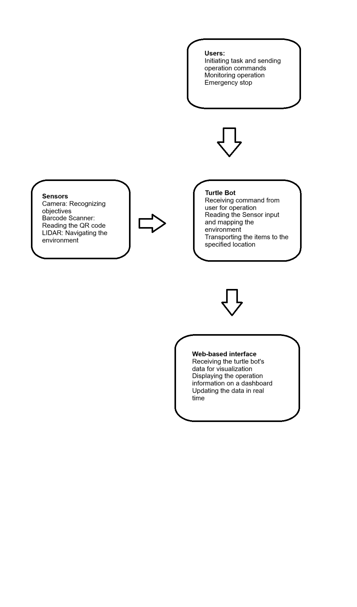
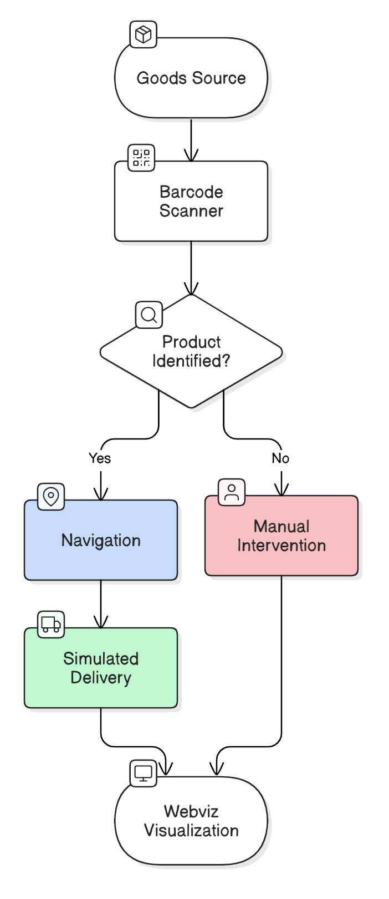
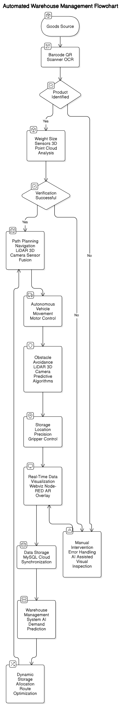

# Project Name:  Autonomous Warehouse Goods Transportation System (Turtlebot Demonstration & Future Scope)
## Team Information
- **Team Number**: Team 08
- **Team Members**:
  - Ha Long Truong
  - Yashwanth Gowda
  
## Semester and Year:
- **Semester**: Spring 2025

## University, Class, Professor:
- **University**: Arizona State University
- **Class**: RAS598 - Experimentation and Deployment of Robotic Systems
- **Professor**: Daniel M. Aukes
---

# Project Plan (Turtlebot Demonstration & Future Scope)

The goal of this project is to develop a robotic system capable of autonomously transporting goods within a warehouse. The robot will be responsible for identifying products, navigating obstacles, and delivering items to specific storage locations. The key research question this project aims to answer is:
How can we design and implement an autonomous robotic system that efficiently and accurately transports goods in a dynamic, obstacle-rich warehouse environment?

This system will leverage advanced sensors (LiDAR, 3D cameras, barcode scanners) and real-time data integration to ensure seamless navigation and precise goods handling. The project will demonstrate its core capabilities through a small-scale demonstration using TurtleBots, with plans for scaling up to more advanced systems in the future.

## Figures Communicating the Idea & Sensor Integration:

### Basic Ideology
 

### For a simple Turtlebot Demonstration:  

### For Future Scope Demonstration:

## Sensor Integration
Sensors play a critical role in ensuring the robot’s ability to navigate and handle products correctly. During the demonstration and testing phases, the following sensors will be used:
* LiDAR & 3D Cameras: These will be used for real-time navigation and obstacle avoidance. They provide spatial awareness of the robot’s environment, enabling it to detect and avoid obstacles in its path.
* Barcode/QR Code Scanners: These sensors will be used for product identification, allowing the robot to recognize the goods being transported and confirm that the right item is taken to the correct location.
* Weight/Size Sensors: These will be utilized to ensure that the goods are correctly sized and weighed before being placed in storage. This ensures that products are handled correctly and no errors occur during transportation.

Turtlebot Demonstration: 
* LiDAR data will be used for real-time mapping and obstacle avoidance.
* A camera-based barcode scanner will identify products.
* Sensor data will be processed using ROS 2 and visualized in Webviz.
* During testing, sensor data will be logged to verify navigation accuracy.
* The final demonstration will show real-time sensor data in Webviz.

Future Scope: 
* LiDAR and 3D camera data will be fused for accurate localization and obstacle detection.
* Barcode/QR code scanners and OCR will be used for product identification.
* Weight/size sensors and 3D point cloud analysis will verify product handling.
* Sensor data will be used for real-time control, decision-making, and data visualization.
* Testing will involve validating sensor accuracy, reliability, and fault tolerance.
* The final demonstration will show the system's ability to adapt to dynamic environmental changes using sensor data.

## Interaction:
To influence the behavior of the robot and allow for seamless interaction, we plan to develop a web-based interface. 

Turtlebot Demonstration: 
- We will influence the Turtlebot's behavior through ROS 2 commands and task assignments.
- Webviz will provide real-time visualization of sensor data and robot status.
- A simplified Node-RED dashboard will allow for basic task assignment.
- Mockup: A web browser window displaying a map of the simulated warehouse with the turtlebot's path, and sensor data graphs.

Future Scope: 
- The full system will be controlled through a web-based interface built with Node-RED and MySQL.
- Users will be able to monitor robot status, adjust routes, and manage inventory.
- AR overlays will enhance situational awareness for human operators.
- Mockup: A professional-looking web dashboard with a 3D map of the warehouse, interactive sensor data graphs, product inventory management, task assignment, and error logs.

## Control and Autonomy:
The robot’s control system will be based on a feedback loop that integrates sensor data to make decisions. The steps involved include:

### Sensor Feedback:
+ Real-time data from the LiDAR, barcode scanner, and weight sensors will be used to assess the environment, identify goods, and verify the appropriate product for transportation.
+ Higher-Level Decision-Making: A decision-making algorithm will process the sensor data and use it to determine the next actions of the robot, including navigation decisions (e.g., avoiding obstacles) and task decisions (e.g., which item to transport to which location).
### Autonomy: 
The robot will operate autonomously based on pre-programmed logic and real-time feedback, adjusting its path and tasks without human intervention.

Turtlebot Demonstration:
- The ROS 2 navigation stack will provide autonomous navigation.
- LiDAR data will be used for obstacle avoidance.
- A state machine will manage task execution.
- The barcode scanner will trigger destination selection.

Future Scope:
- Advanced control algorithms will be implemented for dynamic path planning and decision-making.
- Sensor fusion will provide a robust representation of the environment.
- AI-driven demand prediction will optimize storage allocation.
- Multi-agent coordination will be implemented for multiple robots.

## Preparation Needs:

To succeed in this project, several knowledge areas and skills must be covered:
- Hardware Integration: We need to understand how to integrate various sensors with the robot hardware, such as connecting barcode scanners and weight sensors to the robot’s control system.
- Sensor Data Processing: Knowledge of how to collect, filter, and refine sensor data for navigation and product handling is crucial.
- Web-Based Interface Development: Skills in developing interactive dashboards for real-time monitoring and control of the robot will be necessary.
- Control Systems and Autonomy: We will need a deep understanding of control algorithms and decision-making processes to create an autonomous robot that can navigate and perform tasks efficiently.

In class, topics related to ROS2, sensor integration, and web-based control systems will be crucial. Additionally, we may need specific guidance on using Node-Red or Azure Twin for the user interface.

## Final Demonstration:

Turtlebot Demonstration:
- The Turtlebot will autonomously navigate a simulated warehouse, scan barcodes, and deliver simulated products.
- Resources: Turtlebot, LiDAR, camera, computer with ROS 2, simulated warehouse environment.
- Classroom setup: A designated area for the simulated warehouse.
- Environmental variability: The Turtlebot will handle minor variations in the environment.
- Testing: We will track navigation accuracy and task completion.

## Impact:

This project will have significant learning and practical implications:
* It will deepen our understanding of autonomous robotic systems, particularly in warehouse automation.
* We will gain experience in sensor integration, data processing, and control systems, which are essential skills in robotics and AI.
* By developing the project from prototype to small-scale demonstration, we will learn how to scale and optimize robotic systems for real-world applications, making it applicable for future developments in industrial settings.
* The work may also contribute to the development of new technologies in warehouse automation and autonomous logistics, providing valuable insights for further research.

## Advising:
For this project, we will seek advising from Dr. Aukes (or another faculty member with expertise in automation). The advising will focus on:
* ROS2 for robot control and sensor integration.
* Guidance on Webviz, Node-Red, or Azure Twin for developing the web-based monitoring and control system.
* Assistance with hardware integration and sensor selection (e.g., LiDAR, barcode scanners, weight sensors).
Dr. Aukes (or another advisor) will be expected to provide access to specialized hardware, advice on troubleshooting issues, and mentoring in developing the project’s autonomy and sensor integration. We will aim to meet with the advisor on a regular basis (e.g., weekly or bi-weekly) to track progress and refine our approach.

## Weekly Milestones (Weeks 7-16):

| Week | Hardware Integration | Interface Development | Sensors | Controls & Autonomy |
|------|----------------------|-----------------------|---------|-----------------------|
| 7    | Turtlebot setup       | Webviz setup           | LiDAR data acquisition | Basic navigation setup |
| 8    | Camera mounting       | Node-RED installation   | Barcode scanner integration | Sensor data integration |
| 9    | Simulated warehouse setup | Basic Dashboard creation | Sensor data filtering | Task execution state machine |
| 10   | Testing hardware setup | Refine dashboard design | LiDAR navigation testing | Refine Navigation control |
| 11   | Hardware testing and debugging | Begin Database planning | Barcode testing and Debugging | Task completion testing |
| 12   | Final turtlebot hardware adjustments | Database Implementation | System wide sensor testing | System wide control testing |
| 13   | Research advanced sensors | Begin Node-Red/MySQL integration | Research sensor fusion | Research advanced path planning |
| 14   | Planning full scale robot design | Design full scale dashboard | Planning system wide sensor implementation | Planning advanced control architecture |
| 15   | Planning full scale warehouse simulation | Database testing and implementation | Sensor fusion design | control architecture testing |
| 16   | Documentation and final testing | Finalize Dashboard and database | Final sensor testing | Final control testing |

## Potential Areas for Further Elaboration:
1. Specific Metrics for Evaluation
Initial Phase (TurtleBot Demonstration)
 To assess the effectiveness of our simplified system, we will define specific metrics for evaluation:

Success Rate of Navigation: 
- The percentage of times the TurtleBot successfully reaches the designated target location without deviation.
- Accuracy of Barcode Scanning: The precision and reliability of the barcode scanning system in correctly identifying product codes.
- Time Taken to Complete a Simulated Delivery: The duration taken for the robot to navigate from the pickup point to the assigned warehouse location.
- Error Rates: The percentage of failed tasks due to incorrect barcode readings, navigation failures, or obstacles.

Future Scope (Full-Scale Autonomous Warehouse System)
- For large-scale deployment, the evaluation will focus on robustness, efficiency, and adaptability:
- Throughput: The number of goods successfully transported per unit time.
- Fault Tolerance: The system's ability to function despite sensor failures or obstacles in the warehouse.
- Adaptation Time: The time taken for the robot fleet to adapt to layout changes or new task priorities.
- System Uptime: The percentage of time the system remains operational without requiring maintenance or intervention.

2. Technology Considerations
Control Algorithms
- Simultaneous Localization and Mapping (SLAM): To enable real-time map creation and self-navigation.
- Path Planning Algorithms: A* and Dijkstra for optimized route selection.
- Obstacle Avoidance: Reactive control mechanisms such as the Dynamic Window Approach (DWA) to prevent collisions.

Communication Protocols
- Wi-Fi & ROS2 DDS (Data Distribution Service): For real-time communication between the robots and central control.
- MQTT (Message Queuing Telemetry Transport): For cloud-based warehouse monitoring and reporting.

Software Architecture
- ROS2 (Robot Operating System 2): The core framework to manage sensor data, motion planning, and actuation.
- Microservices-Based Architecture: Enables modular and scalable design, allowing independent upgrades of different subsystems.

3. Challenges and Mitigation Strategies

Initial Phase (TurtleBot-Based Demonstration)
- Sensor Noise: Filtering techniques like Kalman Filters and sensor fusion will help improve accuracy.
- Limited Processing Power: Offloading computation to external servers for real-time decision-making.
- Accuracy of Simulated Environment: Testing in a controlled space with calibrated parameters.

Future Scope (Full-Scale Industrial Implementation)
- Dynamic Environments: Using AI-based predictive path planning to handle moving obstacles.
- Handling Complex Tasks: Integrating AI-based vision processing for flexible and adaptive decision-making.
- Ensuring Safety: Implementing emergency stop buttons, collision detection, and fail-safe protocols.
- Managing a Large Fleet: Developing a cloud-based fleet management system for coordinated operations.

4. Warehouse Environment Details
In the future scope, we aim to design a system suited for:
- E-Commerce Fulfillment Centers: Handling diverse product sizes, high-speed sorting, and real-time inventory management.
- Manufacturing Warehouses: Supporting raw material handling, component delivery, and integration with conveyor belt systems.
- Cold Storage Warehouses: Implementing autonomous robots that function in temperature-controlled environments.

5. Safety Considerations
- Collision Avoidance: Implementing AI-based obstacle detection and predictive path planning.
- Emergency Stop Mechanisms: Hardware and software-based shutdown procedures for immediate halting of operations.
- Worker-Robot Coexistence: Using geofencing and alert systems to prevent unsafe human-robot interactions.

6. Data Management
- Data Storage: A cloud-based system will manage sensor logs, navigation data, and inventory tracking.
- Real-Time Analytics: AI-driven anomaly detection for identifying performance deviations.
- Security & Access Control: Role-based authentication to prevent unauthorized access.

7. Power Management
- Autonomous Charging Stations: Robots will be programmed to dock at charging points when battery levels drop below a threshold.
- Battery Health Monitoring: Using predictive maintenance to prevent sudden battery failures.
- Optimized Power Usage: Implementing energy-efficient path planning and task scheduling.
